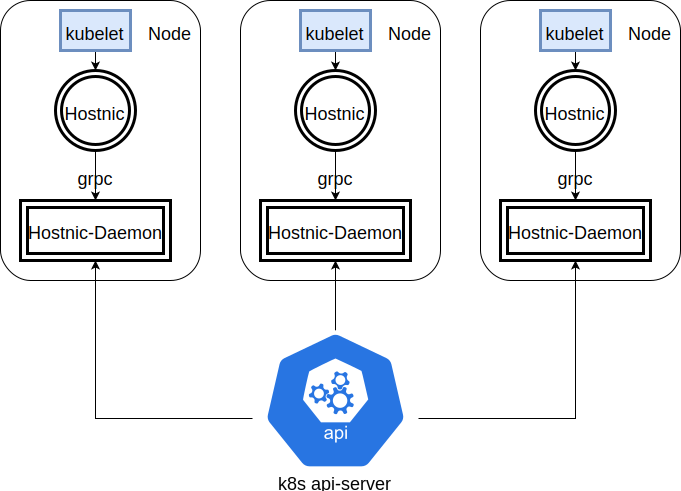
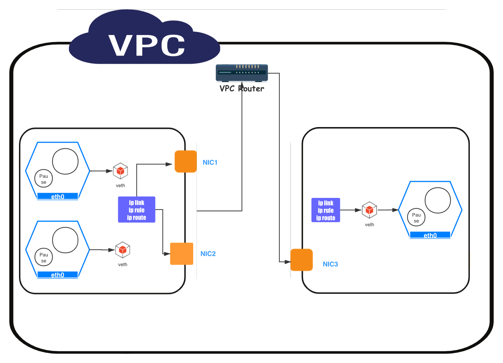

# HostNIC 原理
hostnic 是一个符合CNI(https://github.com/containernetworking/cni)规划的插件，能够被kubelet调用为一个Pod创建网络。

## HostNIC 软件架构


hostnic由两部分组成，一个是符合CNI规范的命令行工具`hostnic`，一个是用于IPAM的GRPC服务`hostnic-daemon`。

`hostnic`实现了CNI，每次创建Pod或者删除Pod，kubelet都会调用这个二进制文件，而这个二进制文件会向Daemon通过GRPC的方式请求IP或者删除IP，如果请求成功，就会在本地执行一些网络规则的创建和删除，包括使用路由策略，iptables等。每个node上都会有一个hostnic二进制文件
`hostnic-daemon`是数据中心，，主要负责本地的IPAM，并不是全局的IPAM。它主要的工作有以下：
1. 负责向iaas申请/卸载网卡，并把网卡加入IP池或从IP池中删除。
2. 响应GRPC请求，正确地赋予/删除Pod IP
3. 不断与k8s api server和IAAS server同步，保证Pod IP的正确性
4. 启动时动态写入CNI config文件，根据用户的设定调整hostnic插件的环境变量

## 启动机制
启动脚本在scripts/下，主要流程如下：
1. 复制`hostnic`和`hostnic-daemon`到CNI目录下
2. 启动hostnic-daemon
3. hostnic-daemon在成功启动之后cni 配置文件目录写入文件
4. kubelet检测到CNI配置文件，开始创建Pod

## 通信原理
k8s对于CNI插件有以下要求：
1. Pod 和Pod通信要在无NAT的情况下能够互相通信，也能互相看到对方正确的IP
2. Pod 和Node也要能在无NAT的情况下互相通信，并且互相能够看到正确的IP
3. 支持Hostnetwork

hostnic插件是基于上述原则进行设计的，网络的架构如下：

如图中所示，首先会将IAAS的网卡挂载到主机上，然后在主机端将其IP移除（这是Pod 所用，主机端有这个IP会导致回路不正确）。每当有一个Pod 需要IP时，hostnic插件会做如下操作：
1. 想Daemon获取一个IP信息（包括ip，mac，以及对应的namespace等）
2. 启动对应的网卡（同样要再删除一遍IP）
3. 创建一对veth，一端在root namespace，一端在Pod namespace里
4. 在Pod namespace中，创建默认路由，并且指定静态arp，最终网络如下：
   ```bash
    #在Pod内部的网络
    IP address

    # ip addr show
    1: lo: <LOOPBACK,UP,LOWER_UP> mtu 65536 qdisc noqueue state UNKNOWN qlen 1
    link/loopback 00:00:00:00:00:00 brd 00:00:00:00:00:00
    inet 127.0.0.1/8 scope host lo
        valid_lft forever preferred_lft forever
    inet6 ::1/128 scope host 
        valid_lft forever preferred_lft forever
    2: eth0@if123: <BROADCAST,MULTICAST,UP,LOWER_UP,M-DOWN> mtu 1500 qdisc noqueue state UP 
    link/ether 56:41:95:26:17:41 brd ff:ff:ff:ff:ff:ff
    inet 192.168.98.2  scope global eth0 <<<<<<< 对应的网卡地址
        valid_lft forever preferred_lft forever
    inet6 fe80::5441:95ff:fe26:1741/64 scope link 
        valid_lft forever preferred_lft forever
    路由

    # ip route show
    default via 169.254.1.1 dev eth0  # 所有的Pod都是用的这个magic ip，参考的calico
    169.254.1.1 dev eth0 

    static arp

    # arp -a
    ? (169.254.1.1) at 2a:09:74:cd:c4:62 [ether] PERM on eth0   这个就是veth另外一端(主机侧)的mac
   ```
### Pod to Pod
Pod的流量通过上述veth流出后，经过通过主机进行路由，路由是通过路由策略实现的。需要在主机端写如下两个规则：
1. To Pod(假设ip为1.1.1.1)：`1.1.1.1 dev nicdsd3218329d  scope link`。其中`nicdsd3218329d`是Pod veth在主机侧的接口，一旦流量到达veth就能顺利到达Pod
2. From Pod（假设ip为2.2.2.2）：这里会写一个策略路由，`from 2.2.2.2 lookup 2`，在2表中的路由如下：
   ```bash
   # ip route show table 2
    default via 2.2.2.1 dev eth1 # eth1是pod的对应的网卡，是通过iaas挂载到主机上的
    2.2.2.1 dev eth1  scope link 
   ```
通过上述路由，Pod出去的流量就能正确地经由Pod对应的网卡，然后通过VPC的路由正确发往对应的目标。

### Pod to external
Pod访问是通过SNAT实现的，hostnic-daemon会查询IAAS信息，得到当前VPC中的所有网段，当Pod访问这些网段时，不走SNAT，直接通过VPC三层互连，而目标不是VPC内的网段时，就会使用SNAT，使用主机端的eth0做SNAT。上述机制是通过iptables实现的
```bash
-A POSTROUTING ! -d <VPC-CIDR> -m comment --comment "kubenetes: SNAT for outbound traffic from cluster" -m addrtype ! --dst-type LOCAL -j SNAT --to-source <Primary IP on the Primary NIC>
```
VPC中的vxnet可能会动态变化，所以hostnic自定一系列chain，每一个chain对应的一个vxnet，如果流量通过了所有chain表示目标地址不在任何一个vxnet里，就会SNAT出去，反之中途出了chain就不经源地址转换直接发给VPC的路由器

## IPAM

为了加快Pod获取的速度，`hostnic-daemon`会预先申请一些网卡，同样在Pod删除之后，也会将多余的网卡归还给IAAS
